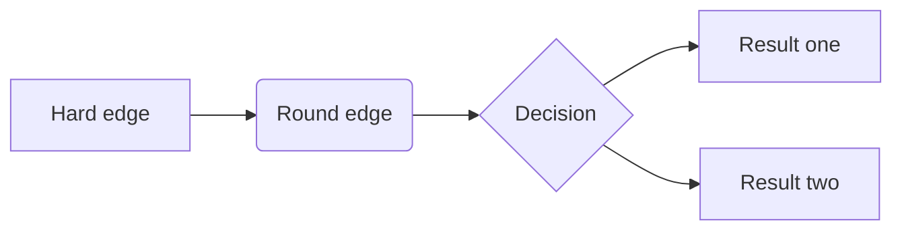

先复习一下名词所有格和物主代词

1. 名词所有格
	1. 有生命的名词 + 's  Monther's 妈妈的   一般做前定，修饰名(都可以) Lily's tea，名词复数s结尾，那么使用's   
	2. 无生命的名词 `of+无生命的名词`   做后定  注意单复数问题，The center of the city  修饰的名词无论是什么名词，都要加冠词`the`
2. 物主代词
	
	1. 形容性物主代词   做前定 ,一定修饰名词 my books  注意名词单复数
	2. 名词性物主代词   做 主，表，宾等 只有前面提到过的才能使用   
		mycar is very good  
		I want yours

# 双重所有格

## 概念

1. of + 有生命的名词's  表示某人的      比如 of mother's 妈妈的
2. of＋名词性物主代词  表示某人的     of mine  我的

双重所有格主要作后置定语，修饰一个普通名词，然后，双重所有格含有全体中的一部分的意思。
`he is a friend of my father‘s＝he is one of my father’s friends` 他是我爸爸的朋友当中的一个。

## 作用

1. 双重所有格修饰的名词通常还有一个限定词（如：a an any some no few several．．基数词：two three four...）作前置定语，比如：
	`Two classmates of my friend＇s have been to Hongkong.`我朋友的两个同学去过香港。

2. 双重所有格修饰的名词通常可以用指示代词 this，that来表示某种感情色彩。
	`That answer of Jack＇s was not right.`杰克的那个回答不对。

3. of后面带有＇s的通常是人的名词或者名词性物主代词

	`That＇s a play of Shakespear＇s` 那是莎士比亚的一个戏剧。

# 反身代词

|          | 单数                                             | 复数                            |
| -------- | ------------------------------------------------ | ------------------------------- |
| 第一人称 | Myself   我自己                                  | Ourselves 我们自己              |
| 第二人称 | Yourself 你自己                                  | Yourselves 你们自己             |
| 第三人称 | Himself   他自己 herself   她自己 itself  它自己 | Themselves 他们／她们／它们自己 |

## 作用

1. 作宾语，含有“自己”的意思
	`The little girl can look after herself` 这个小姑娘能照顾自己。

2. 作介词宾语，比如：`about myself`

3. 作同位语，起强调作用，置于名词，代词的后面或者句末，表示“自己”或者“亲自”的意思。
	`she answered the phone herself`她亲自接电话。 

4. 作表语
	`He said the fat boy was himself。他说那个胖胖的小男孩就是他自己。`

5. 构成某些惯用语。如：by oneself（独自地，一个人地）

	`Did you go there by yourself？` 你一个人去那里吗？

# 相互代词

相互代词有``each other`，`one another`,其所有格分别为 `each other＇s`，`one another＇s `

each other表示两者之间，one another表示三者或三者以上之间

一般作宾语或介词宾语，其所有格作前置定语（相互，彼此）

We must help each other．我们应该互相帮助（这里的“我们”只有两个人） 状语

we must help one another我们应该互相帮助（这里的“我们”指三个人或三人以上）

They know one another＇s shortcomings．他们都知道彼此的缺点。（这里的“他们”有三个人以上）前置定语

# Such and same的用法（属于指示代词）

## such

such指“这样的”人或者事，在句中作主语和前置定语

`Such was the story`故事就是这样了。（主语）

such作前置定语时，名词前面有不定冠词a，an，则将不定冠词放在such后面，而且一般a，an后面还有其他的形容词作定语，基本按照以下构成方式：

`Such＋a／an＋形容词＋可数名词单数`，比如：

We have never seen such a big house.我们从来没有见过如此大的房子。

He has never met such a beautiful girl.他从未见过这样漂亮的女孩

this is such an important lesson.这是如此重要的一节课。

## same

Same 指“同样的”人或事，在句中作主语，表语，宾语和前置定语。same的前面一定有加定冠词the。

`The same can be mentioned in the other article`.另一篇文章也会提到同样的情况。（主语）

`Whether he can come or not， it is all the same to me`。他是否能来，对我来说都一样。（表语）

He dived，his students did the same.他潜水，他的学生也跟着潜水。（宾语）

Same作前置定语的情况最常见，而且多数修饰可数名词单数，特殊情况除外，

`They have the same reason。他们有同样的原因（前置定语）`   不可数名词

`We are from the same place.我们来自同一个地方。（前置定语）  ` 可数名词

# 不定代词

